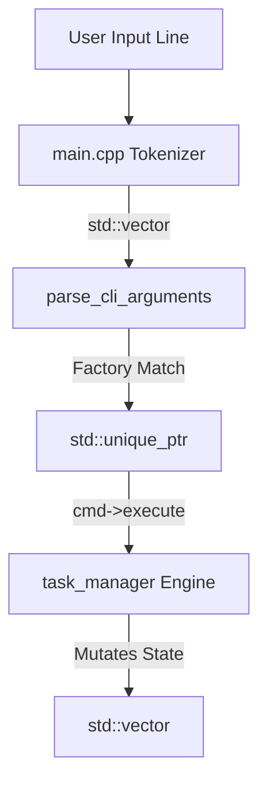

# Simple CLI Task Manager

A robust, object-oriented CLI task manager built from scratch using modern **C++20** standards.
This project implements a fault-tolerant data persistence system.

## Highlights

* **Command Pattern:** Decoupled CLI parsing from execution logic using runtime polymorphism (
  `std::unique_ptr<i_command>`).
* **Resource Management:** Deep control over object lifecycle in the `task` class, disabling explicit copy/assignment
  operations (`= delete`)
  and enforcing efficient move semantics (`task && = default`).
* **Fault-Tolerant Persistence:** State serialization with automated recovery mechanisms. The system implements
  automated
  `.back` (backup) hot-swapping and `.temp` (temporary state isolation) to avoid file corruption upon fatal parse
  errors.
* **Linear Tokenizer:** Linear command parsing with string sanitization (*left/right trimming*) utilizing custom
  delimiter evaluation (`;`).

## Architecture Flow



## Syntax & Commands

The CLI supports argument processing, allowing spaces within fields by separating parameters with a semicolon (`;`).

```bash
# General
help                            # Display command matrix.
exit                            # Terminate the session.

# File Operations
load <path>                     # Load a specific database (.tsk)
reload                          # Reload the active file descriptor.
save <path>                     # Save changes to the specified path.
save                            # Save changes to the current file.
file                            # Print current working file name.

# Task Operations
display                         # Render all tasks in a 4-column matrix.
check                           # Compute metrics (completion rate, pending count).
see <id>                        # Inspect a specific task's metadata.
add <name>; <description>       # Create a new task (supports spaces).
delete <id>                     # Erase a task utilizing std::erase_if (C++20).
edit <field>; <id>; <new>       # Change the specific field of a task to a new value.
copy <id>                       # Clone an existing task with a new auto-incremented ID.
mark <id>                       # Set task state to completed.
unmark <id>                     # Set task state to pending.
```

## Storage Format (.tsk)

The database structure serializes the next available ID followed by 4-line blocks per task:

```text
lid:3
1
Go to the market
Buy milk, bread and eggs
0

2
Study physics
Review waves
1
```

## Compilation & Requirements

The project uses CMake as its build system and requires a compiler with full C++20 support (e.g., GCC 13+, Clang 15+, or
MSVC 2022+).

## Build Instructions

Clone the repository:
```bash
git clone https://github.com/NotMattyS/Simple-Task-Manager.git
cd Simple-Task-Manager
```

Generate build files using CMake:
```bash
cmake -B build
```

Compile the project:
```bash
cmake --build build
```

Run the executable:
```bash
./build/task_manager_cli
```

> On Windows with MSVC, the executable may be located inside:
> `build/Debug/` or `build/Release/`

## Notes
For GCC and Clang builds, the executable is linked statically using:
- `-static`
- `-static-libgcc`
- `-static-libstdc++`

Developed natively in JetBrains CLion.
